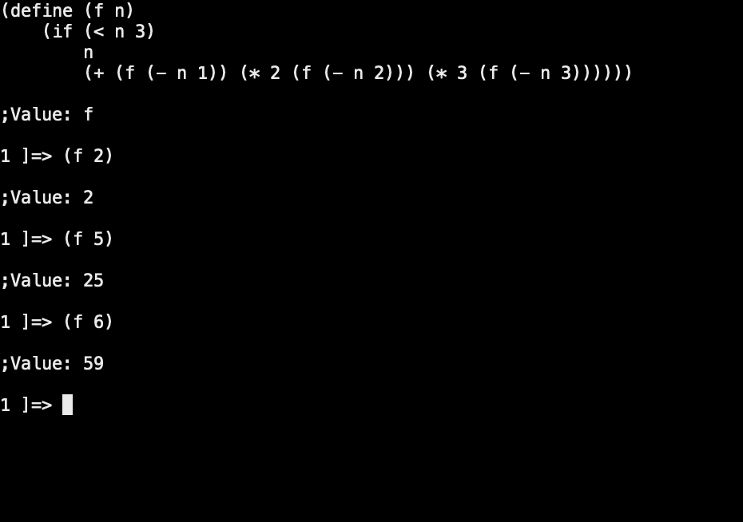
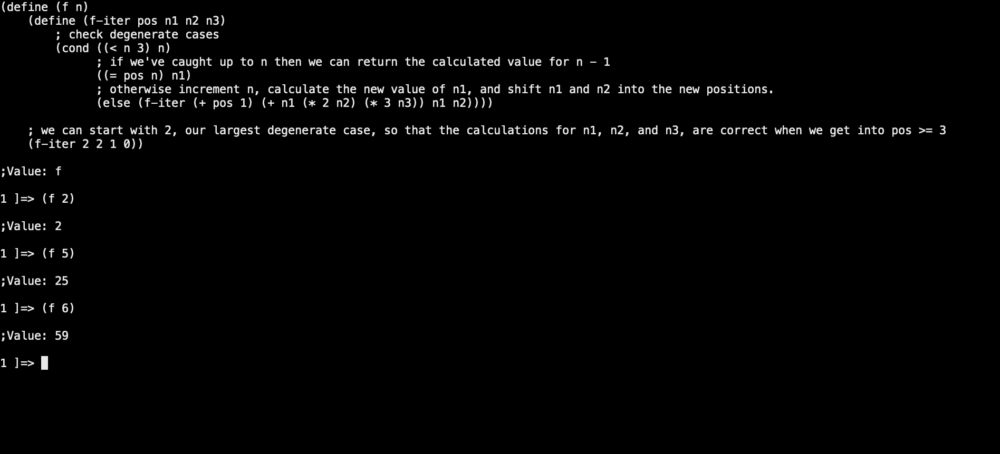

**April 15, 2023**

# Exercise 1.11

A function _f_ is defined by the rule that _f_(_n_) = _n_ if _n_ < 3 and _f_(_n_) = _f_(_n_ - 1) + 2*_f_(_n_ - 2) + 3*_f_(_n_ - 3) if _n_ >= 3.
Write a procedure that computes _f_ by means of a recursive process. Write a procedure that computes _f_ by means of an iterative process.

## Recursive Process

Writing this procedure in a recursive process should be fairly simple, as we can basically just translate the formal definition directly into scheme.

```scheme
(define (f n)
    (if (< n 3)
        n
        (+ (f (- n 1)) (* 2 (f (- n 2))) (* 3 (f (- n 3))))))
```

To test out our procedure let's compute the values for _n_ in [2, 5, 6] manually and then validate that the procedure returns the correct result.

1. _n_ = 2 = 2 (because _n_ < 3)
1. _n_ = 5   
    = _f_(5)  
    = _f_(4) + 2*_f_(3) + 3*_f_(2)  
    = _f_(3) + 2*_f_(2) + 3*_f_(1) + 2(_f_(2) + 2*_f_(1) + 3*_f_(0)) + 6  
    = _f_(2) + 2*_f_(1) + 3*_f_(0) + 4 + 3 + 2(2 + 2 + 0) + 6  
    = 2 + 2 + 0 + 4 + 3 + 8 + 6  
    = 25
1. _n_ = 6  
    = _f_(5) + 2*_f_(4) + 3*_f_(3)  
    = 25 + 2*(11) + 3*(4) // we're using answers calculated in _n_ = 5 to expedite this process  
    = 25 + 22 + 12  
    = 59

And if we input these values of _n_ into our scheme procedure:



It appears to be working!

## Iterative Process

Because the definition of this procedure dictates that _f_(_n_) where _n_ >= 3 relies on the calculations of _f_(_n_ - 1), _f_(_n_ - 2), and _f_(_n_ - 3), we must write our procedure 
to calculate from the bottom-up if we want it to be iterative.

We can start by determining our lower bounds. 
These are laid out in the formal definition as anything less than 3, which we can visualize as [2, 1, 0] and express as _n_-1, _n_-2, and _n_-3, respectively, for _n_ = 3.

Now that we have our degenerate cases we can start from the bottom and work our way up to _n_, updating our values for _n_-1, _n_-2, and _n_-3, as we increment our position in the algorithm.


```scheme
(define (f n)
    (define (f-iter pos n1 n2 n3)
	; check degenerate cases
	(cond ((< n 3) n)
	      ; if we've caught up to n then we can return the calculated value for n - 1
	      ((= pos n) n1)
	      ; otherwise increment n, calculate the new value of n1, and shift n1 and n2 into the new positions.
	      (else (f-iter (+ pos 1) (+ n1 (* 2 n2) (* 3 n3)) n1 n2))))

    ; we can start with 2, our largest degenerate case, so that the calculations for n1, n2, and n3, are correct when we get into pos >= 3
    (f-iter 2 2 1 0))
```

And if we use the manually calculated answers that were used to validate the recursive process again:



The iterative process appears to be working!

