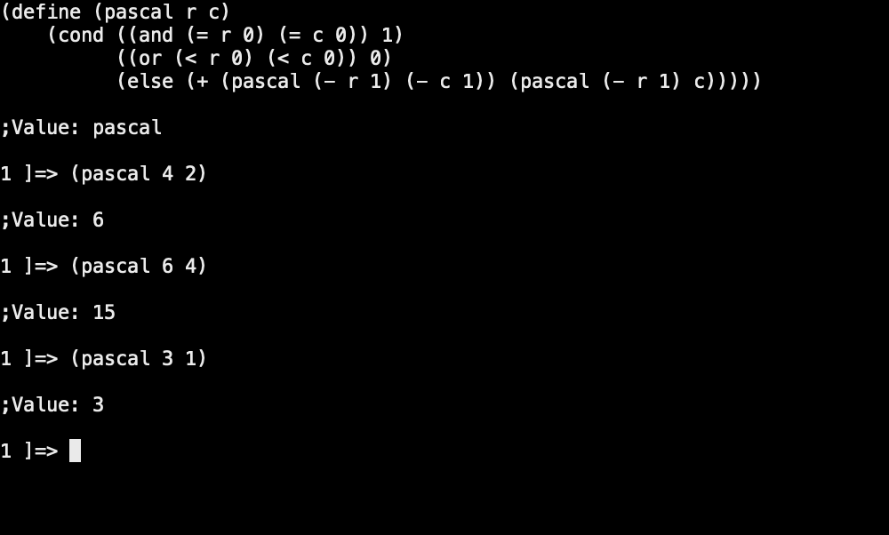

**April 15, 2023**

# Exercise 1.12

> The following pattern of numbers is called _Pascal's triangle_.

            1  
          1   1  
        1   2   1  
      1   3   3   1  
    1   4   6   4   1  
           ...

> The numbers at the edge of the triangle are all 1, and each number inside the triangle is the sum of the two numbers above it.
> Write a procedure that computes the elements of Pascal's triangle by means of a recursive process.

## Initial Thoughts

After reading through this exercise several times I was still confused by what exactly and element of the triangle was, 
and a quick trip to the <a href="https://en.wikipedia.org/wiki/Pascal's_triangle" target="_blank">Wikipedia article</a> on Pascal's Triangle cleared things up. 
Specifically, the <a href="https://en.wikipedia.org/wiki/Pascal's_triangle#Formula" target="_blank">Forumla section</a> 
helped me to think of each element as being a coordinate in the triangle, with a row and column, rather than as a serial element ID.

## Pascal's Rule

Pascal's Rule states that for any natural numbers _n_ and _k_,

(_n_ _k_) = (_n_ - 1 _k_ - 1) + (_n_ - 1 _k_)

where (_n_ _k_) is a binomial coefficient.


We can apply this to our problem by saying that for any _row_ (_n_) and _column_ (_k_) where _row_ and _column_ are natural numbers 
we can calculate the element in Pascal's triangle by (_row_ - 1 _column_ - 1) + (_row_ - 1 _column_).


## Scheme

To define this procedure in a recursive process in scheme all we have to do is define our degenerate cases, _r_ = 0 and _c_ = 0, and _r_ < 0 or _c_ < 0, and then recursively call
the procedure using _r_ - 1, _c_ - 1, _c_.

```scheme
(define (pascal r c)
    (cond ((and (= r 0) (= c 0)) 1)
          ((or (< r 0) (< c 0)) 0)
          (else (+ (pascal (- r 1) (- c 1)) (pascal (- r 1) c)))))
```

And a quick test shows that the procedure is working!



